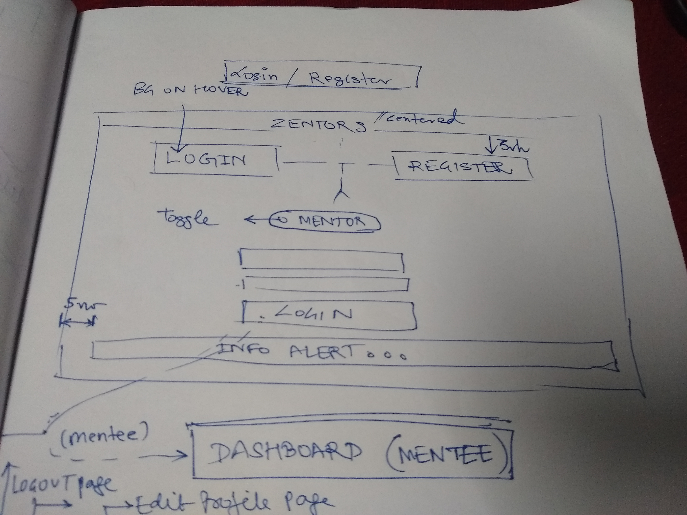
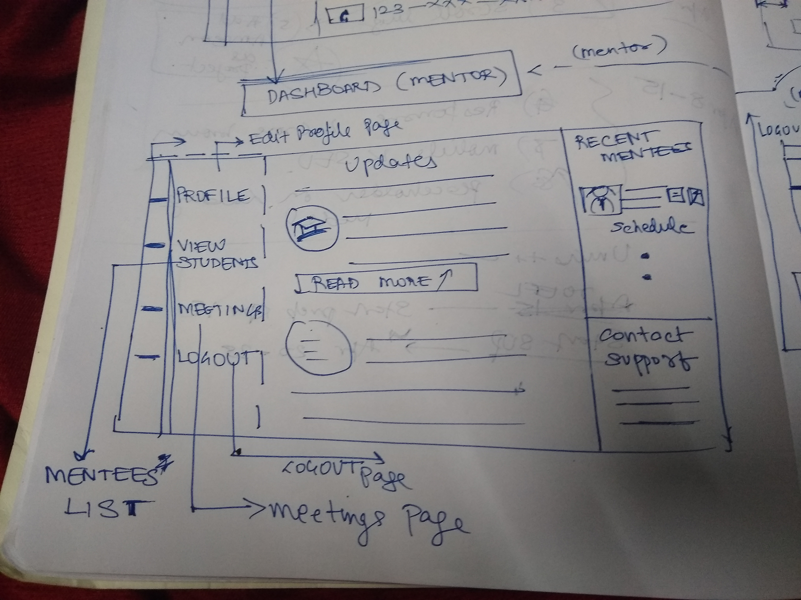
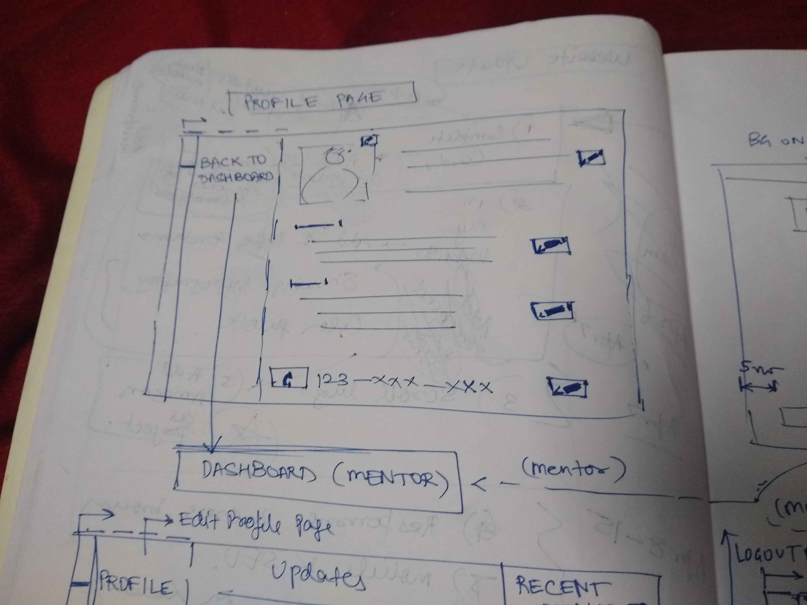
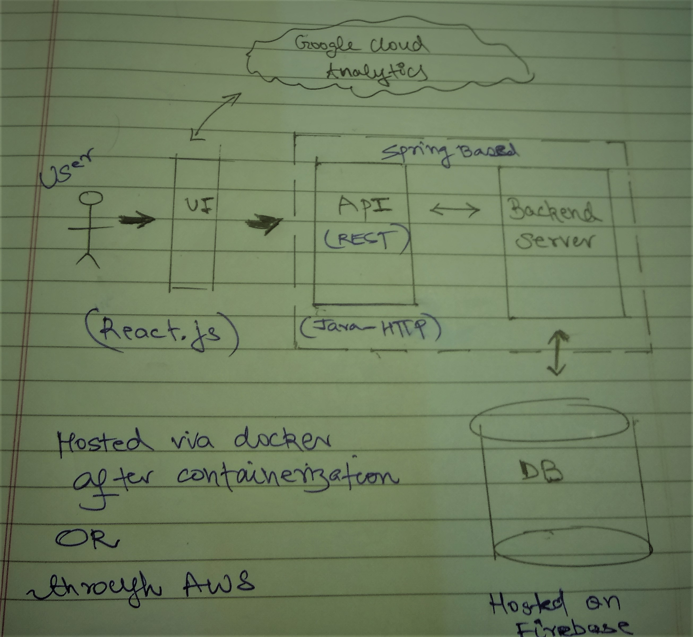

## About Zentors
Zentors is a mentoring platform startup helping students connect with seniors all around the world for their higher education guidance. It was started by students of Stanford University, California

## ZentorsUI
The front-end starter code for Zentors. I voluteered to work on this project as the UX designer & Software Developer in addition to supervising the tech architecture of the  new website.

This is a documentized code of the login functionality of the mockups I proposed, based on my interactions with one of the co-founders - Rishabh Kothari.

## Need & User research
Zentors aims to provide a platform which makes interaction of students and mentors possible. Students who are in the final years of their college or are aspiring to go back to school again for a Master's / PhD. degree often get lost. There are tons of information available on the internet and the presence of scam agencies makes it difficult for such students to find guidance. Being in the same boat myself, I feel close to this product as it will help many students achieve their goals of entering their dream education programs! Therefore, this platform will solve the problem of connecting students with mentors who are currently studying in the aspirant's university or have graduated from there. Not only would it make easier to find guidance, but also assure authenticity from the mentors. 

From choosing a career path to narrowing down to one's dream universities is a taxing task, which involves months of preparation. For this reason, students prefer to be engaged in the process for a long term. In the new model we ideate a milestone based system, which would enable the mentor to design a path for the student till the moment he or she gets admission. The initial calling and guidance is free, and further milestones may be charged depending on how much the student is able to benefit of it. 

The existing prototype for the website was built up on wordpress as an experiment with its concomintant limitations of lack of control of data. For an application where the admin has complete control of user traffic on their website along with other data analytics considerations, it is important to have a web app which is made inhouse. 

Another requirement asked by the users was of new features including a login based system and a video application / online doodle based system for discussions between the mentor and mentee. An important feature is that the mentors and mentees would be able to track their progress and get in touch again with a click, which separates Zentors from its competitors. Moreover, an audio / video call based on pre-booked sessions would help monetize the business more easily than resorting to 3rd party applications. This would be a vital feature because having a profile based system would allow the students using the application to stay more 'indulged' in the process of being a mentee. Furthermore, the mentors would be able to manage their appointments with far more ease than through manual work.

## Key Features Proposed
- Profiles for mentors and mentees
- Dashboard for tracking progress
- News & Updates 
- Inbuilt calling feature
- Custom guidance plans for students

## Introduction
This project was started as an experiment for redesigning the Zentors.org website and researching on the software architecture. The finalized structure includes - A shade of blue as the primary brand color (mainly because it is associated with an orderly and peaceful impact, and doesn't deviate from the previous version), React based Single Page Application in the front-end having new user login functionality which includes server side security using JSON Web Tokens ( https://jwt.io/ ). Usable components architecture from React will allow us to make development streamlined especially when the website has alot of parts like cards which can be made once and deployed multiple times! The backend will make use of Mongo-DB database written up in Python. All the servers will be hosted via Heroku using a custom domain: Zentors.com or likewise.

## Wireframe sketches

### Login / Register Page

### Dashboard ( Mentor )

### Dashboard ( Mentee )

### Profile Page

## Some of the features of the login.
### Alerts
Informative alerts at the bottom of the form for failed login & register attempts. In the actual UI, colors will wary depending upon the severity of the alert.
A very common fallback pattern is to include 'Forgot Password?' in the alert. 

### An simplistic register portal
A simplistic register / login portal switchable at the click of a button. Descriptive with placeholders & buttons with ample areas and spacing for a fluent user experience. 
The elements are intentionally large and logically close to adhere to the UX laws of proximity, similarity and Fitt's law.

A customized switch for mentor / mentee login which makes for an intuitive switch. Since the bigger audience would be Mentees, the switch has this default value.

### Dashboard skeleton
A similar fashioned dashboard which greets the username logged in ( 'user' in this case ). Using the native 'password' type in the form allows for google's password caching. 
This obviates the need for entering the password everytime. On top of that, implementing cookies ensures that the user is logged in across all tabs in this session, and would be redirected to their dashboard automatically.

### Architecture plan

## Available Scripts

In the project directory, you can run:

### `npm start`

Runs the app in the development mode. 
Open [http://localhost:3000](http://localhost:3000) to view it in the browser.

The page will reload if you make edits. 
You will also see any lint errors in the console.

### `npm test`

Launches the test runner in the interactive watch mode. 
See the section about [running tests](https://facebook.github.io/create-react-app/docs/running-tests) for more information.

### `npm run build`

Builds the app for production to the `build` folder. 
It correctly bundles React in production mode and optimizes the build for the best performance.

The build is minified and the filenames include the hashes. 
Your app is ready to be deployed!

See the section about [deployment](https://facebook.github.io/create-react-app/docs/deployment) for more information.

### `npm run eject`

**Note: this is a one-way operation. Once you `eject`, you can’t go back!**

If you aren’t satisfied with the build tool and configuration choices, you can `eject` at any time. This command will remove the single build dependency from your project.

Instead, it will copy all the configuration files and the transitive dependencies (Webpack, Babel, ESLint, etc) right into your project so you have full control over them. All of the commands except `eject` will still work, but they will point to the copied scripts so you can tweak them. At this point you’re on your own.

You don’t have to ever use `eject`. The curated feature set is suitable for small and middle deployments, and you shouldn’t feel obligated to use this feature. However we understand that this tool wouldn’t be useful if you couldn’t customize it when you are ready for it.

## Learn More

You can learn more in the [Create React App documentation](https://facebook.github.io/create-react-app/docs/getting-started).

To learn React, check out the [React documentation](https://reactjs.org/).

### Code Splitting

This section has moved here: https://facebook.github.io/create-react-app/docs/code-splitting

### Analyzing the Bundle Size

This section has moved here: https://facebook.github.io/create-react-app/docs/analyzing-the-bundle-size

### Making a Progressive Web App

This section has moved here: https://facebook.github.io/create-react-app/docs/making-a-progressive-web-app

### Advanced Configuration

This section has moved here: https://facebook.github.io/create-react-app/docs/advanced-configuration

### Deployment

This section has moved here: https://facebook.github.io/create-react-app/docs/deployment

### `npm run build` fails to minify

This section has moved here: https://facebook.github.io/create-react-app/docs/troubleshooting#npm-run-build-fails-to-minify
